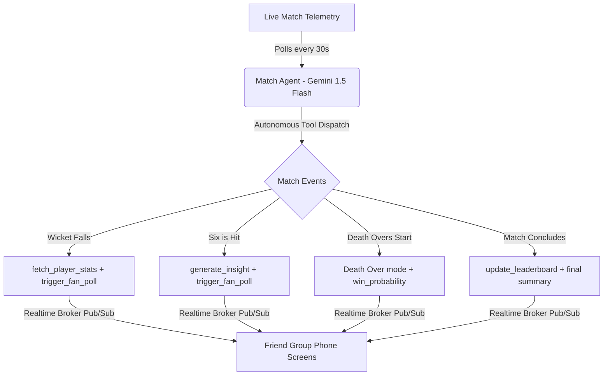

# 🏏 The 12th Man – Live AI Cricket Sidekick

**The 12th Man** is a live AI second-screen phone companion built for the Google Cloud **"Build with AI – Agentic Premier League"** hackathon. 

When fans watch cricket on TV, they usually stay passive. **The 12th Man** turns them into active participants. Running on your phone, it automatically watches live match data, coordinates predictions within friend groups, provides real-time tactical insights, and triggers interactive mini-challenges—**completely autonomously, without the user having to trigger or request anything.**

---

## 🚀 Key Concept & Architecture
The entire app revolves around the **Match Agent**, an autonomous AI supervisor built with the **Google GenAI SDK (Gemini 1.5 Flash)**. It polls cricket scoreboards every 30 seconds (via CricAPI or simulated feeds) and executes a suite of specialized tools depending on the live match telemetry:



### 🛠️ The 5 Core Match Agent Tools (Google ADK Style)
1. `fetch_match_data`: Queries CricAPI (or local simulator) for the latest live ball-by-ball scoreboards.
2. `fetch_player_stats`: Dynamically pulls career benchmarks and historic profiles for active or newly dismissed batters.
3. `trigger_fan_poll`: Broadcasts context-aware prediction challenges to all fans logged into a room.
4. `generate_insight`: Calls Gemini 1.5 Flash to synthesize high-adrenaline, Harsha Bhogle-style commentary about the current over.
5. `update_leaderboard`: Aggregates points (+100 for correct guesses) and ranks friends on a live leaderboard.

---

## 🛠️ Tech Stack & GCP Integration (Free Tier)
- **Frontend**: Next.js 14 / Vite React + Tailwind CSS v4 + Lucide Icons -> Deployed on **Firebase Hosting** (Free Tier).
- **Backend**: Python + FastAPI + WebSockets -> Deployed on **Google Cloud Run** (Free Tier).
- **AI Agent**: Google GenAI SDK with **Gemini 1.5 Flash** (Free Tier).
- **Realtime sync**: Google Cloud Pub/Sub / WebSocket Broadcasts (Free Tier).
- **Database**: Google Cloud **Firestore** (Free Tier) to store room lobby details and point leaderboards.

---

## 🔑 Credential Setup Guide

### 1. Google Gemini API Key
1. Go to [Google AI Studio](https://aistudio.google.com/).
2. Click **Create API Key** and copy the resulting string.
3. Add it to the backend environment variables (`GEMINI_API_KEY`) or paste it directly into the **Settings Drawer** in the UI!

### 2. CricAPI.com Live Data Key
1. Visit [CricAPI.com](https://cricapi.com/) and sign up for a free developer account (100 free requests per day, perfect for live hackathon demos).
2. Copy your API Key from the dashboard.
3. Place it in the backend environment variables (`CRICAPI_KEY`) or input it in the UI Settings Drawer.
   *(Note: If no CricAPI Key is provided, the backend automatically transitions to high-fidelity **Simulated Live Mode**, ensuring a 100% stable, interactive demo for judges regardless of API keys!)*

---

## 💻 Running the App Locally

### Step 1: Run the Python FastAPI Backend
1. Open a new terminal in the workspace root and install the dependencies:
   ```bash
   pip3 install -r backend/requirements.txt
   ```
2. Set up your local environment file:
   ```bash
   echo "GEMINI_API_KEY=your_gemini_key_here" > backend/.env
   echo "CRICAPI_KEY=your_cricapi_key_here" >> backend/.env
   ```
3. Start the dev server:
   ```bash
   python3 -m uvicorn backend.main:app --host 127.0.0.1 --port 8000 --reload
   ```
   *Backend will run at `http://127.0.0.1:8000`*

### Step 2: Run the React / Next Frontend
1. Open a second terminal, navigate to the `/frontend` directory, and install npm modules:
   ```bash
   cd frontend
   npm install
   ```
2. Start the Vite React hot-reload server:
   ```bash
   npm run dev
   ```
   *Frontend will run at `http://localhost:5173/`*

---

## ☁️ Google Cloud Deployment Instructions

### 1. Deploy the Backend to Google Cloud Run
1. Make sure you have the [Google Cloud CLI](https://cloud.google.com/sdk/gcloud) installed and authenticated:
   ```bash
   gcloud auth login
   gcloud config set project YOUR_PROJECT_ID
   ```
2. Build and deploy the FastAPI Docker container to Cloud Run (fully within the GCP free tier):
   ```bash
   cd backend
   gcloud run deploy the-12th-man-backend --source . --platform managed --allow-unauthenticated --region us-central1 --set-env-vars GEMINI_API_KEY=your_gemini_key,CRICAPI_KEY=your_cricapi_key
   ```
3. Note down the **Service URL** provided (e.g., `https://the-12th-man-backend-xxxx.a.run.app`). Change the WebSocket protocol prefix in your frontend connection string to point to this Cloud Run hostname!

### 2. Set Up Google Cloud Firestore
1. Navigate to the [Google Cloud Console](https://console.cloud.google.com/).
2. Search for **Firestore** and click **Create Database**.
3. Choose **Native Mode** and set your region. Select **Start in Production** or **Test Mode** (which allows fast unauthenticated development writes).
4. Since the Python backend handles connection authentication automatically using the default service account, Firestore requires zero hardcoded configuration files!

### 3. Deploy the Frontend to Firebase Hosting
1. Install the Firebase CLI tool globally:
   ```bash
   npm install -g firebase-tools
   ```
2. Log in and initialize Firebase within the `/frontend` folder:
   ```bash
   firebase login
   firebase init
   ```
   - Select **Hosting: Configure files for Firebase Hosting**.
   - Choose your existing Google Cloud Project.
   - Specify **`dist`** as your public directory (since we compile using Vite).
   - Configure as a single-page app (enter **Yes** to rewrite all URLs to `/index.html`).
3. Compile the production bundles and deploy:
   ```bash
   npm run build
   firebase deploy --only hosting
   ```
4. Firebase Hosting will output your live URL (e.g., `https://your-project.web.app`) for the judges to open on their phones!

---

## 🏏 How to Demo the App Live to Judges
1. Open the frontend URL on your laptop and phone.
2. Enter your Fan Name (e.g. "King Kohli") and click **Create Friend Room** to obtain a unique 4-digit room code Kahoot-style (e.g. `4080`).
3. Share the code with your friends/judges. They can type the code and join your room lobby instantly!
4. Expand the **Settings Drawer** (gear icon) to save your Google Gemini API Key and CricAPI credentials.
5. In the bottom-right corner, click **Simulate Events** to expand the demo injector panel. Test these live triggers:
   - **💥 Hit Six**: Telemeters a boundary strike. The AI Match Agent immediately writes witty boundary commentary and triggers a fan prediction card: *"Predict his next ball after that massive 6!"*
   - **🔴 Wicket**: Triggers a dismissal. The Match Agent invokes the career stat tool to output the batsman's profile, writes commentary, and prompts fans: *"Who will anchor the crease?"*
   - **⚡ Death Over**: Activates high-adrenaline mode, changing UI accents to bright red, and shifts live win probability bars with detailed AI-generated tactical reasoning.
   - **🏆 India Win**: Concludes the match, displaying final leaderboards, congratulating the room winner, and playing stadium arpeggio fanfares!
